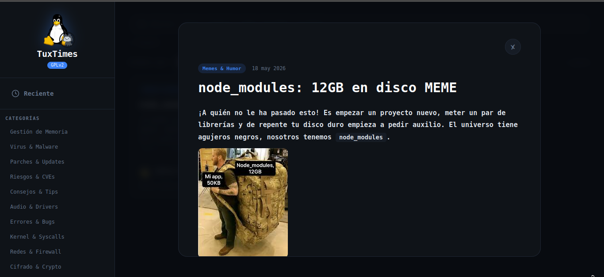

<div align="center">

```
████████╗██╗   ██╗██╗  ██╗    ████████╗██╗███╗   ███╗███████╗███████╗
╚══██╔══╝██║   ██║╚██╗██╔╝       ██╔══╝██║████╗ ████║██╔════╝██╔════╝
   ██║   ██║   ██║ ╚███╔╝        ██║   ██║██╔████╔██║█████╗  ███████╗
   ██║   ██║   ██║ ██╔██╗        ██║   ██║██║╚██╔╝██║██╔══╝  ╚════██║
   ██║   ╚██████╔╝██╔╝ ██╗       ██║   ██║██║ ╚═╝ ██║███████╗███████║
   ╚═╝    ╚═════╝ ╚═╝  ╚═╝       ╚═╝   ╚═╝╚═╝     ╚═╝╚══════╝╚══════╝
```

# 🐧 TuxTimes

<br/>



<br/>

### *El lector de noticias Linux que nació de la rabia pura y el odio a los paywalls arcaicos*

[](https://vuejs.org/)
[](https://firebase.google.com/)
[](https://www.gnu.org/licenses/old-licenses/gpl-2.0.html)
[](https://lwn.net)
[](.)
[](.)

<br/>

> *"Nació porque estaba enojado con páginas con paywalls arcaicos (te hablo a ti → lwn.net ←)"*
>
> — El autor, comentario en el código, línea 8

<br/>

🐧 **Un pingüino rebelde · Una app de Vue · Un grito de independencia informativa** 🐧

</div>

---

## 🏆 TuxTimes vs LWN.net — La Comparativa Final

> *LWN lleva desde 1998. TuxTimes lleva un fin de semana. El resultado habla solo.*

| Feature | TuxTimes | LWN.net |
|---------|:--------:|:-------:|
| 🌑 Dark mode | ✅ | ❌ |
| ☀️ Light mode | ✅ | ❌ |
| ⚡ High Contrast (modo hacker) | ✅ | ❌ |
| 💸 Gratis para leer | ✅ | ❌ ($35/año) |
| ✍️ Cualquiera puede publicar | ✅ | ❌ (solo editores) |
| 🔍 Búsqueda con #tags | ✅ | 😬 |
| 📄 Paginación | ✅ (20/página) | 😬 |
| 🔤 Sort por nombre y fecha | ✅ | ❌ |
| 📱 Responsive móvil de verdad | ✅ | 💀 |
| 💬 Comentarios en árbol | ✅ (con poda de fantasmas™) | ✅ (pero feo) |
| ⭐ Sistema de favoritos | ✅ | ❌ |
| 👤 Perfiles públicos de autor | ✅ | 😬 |
| 🎨 Temas guardados en cookie | ✅ | ❌ |
| 🗺️ Hash routing compartible | ✅ | ❌ |
| 🥚 Easter egg de Windows/BSOD | ✅ | ❌ (obvio) |
| 🤖 Pingüino bounceando | ✅ | ❌ |
| 🐱 Octocat en el logo | ✅ | ❌ |
| 📝 Editor Markdown con preview | ✅ | ❌ |
| 🔑 Google OAuth + Email | ✅ | ❌ |
| **SCORE FINAL** | **🏆 19/19** | **💀 3/19** |

**TuxTimes gana. Partido terminado. LWN puede irse a casa.**

---

## 📖 ¿Qué es TuxTimes?

TuxTimes es una plataforma de noticias y artículos sobre Linux y software libre, construida con **Vue 3 + Firebase**, que nació de un momento de frustración completamente comprensible.

> ese "alguien" que la construyó soy **yo** — **Qmaker** (Andres / Andresuno) 🫡
> en un solo App.vue de **2292 líneas**. ¿Por qué? Porque estaba enojado. ¿Funciona? Perfectamente.

La licencia es **GPLv2**. También por enojo.

---

## 🌐 El Contexto Histórico: LWN.net y el Gran Paywall del Kernel

**LWN.net** (*Linux Weekly News*) es uno de los portales de noticias técnicas sobre el kernel Linux más respetados del planeta. Desde **1998**. Sí, lleva más años en internet que la mayoría de sus lectores en el mercado laboral.

```
1998 ─────────────────────────────────────────────────────── HOY
 │                                                              │
 └─ LWN nace          LWN sigue igual de arcaico ─────────────┘
    Google no existe   (el CSS tampoco ha cambiado mucho)
```

### 🤔 ¿Entonces cuál era el problema real?

No era el contenido. Era **todo lo demás.**

**1. 💸 El conocimiento no debería tener paywall**

El kernel Linux es GPL. Los artículos que lo explican están detrás de un muro de $35/año. Hay algo irónico en eso que no se puede ignorar.

**2. 🔒 No cualquiera puede publicar**

LWN es un medio cerrado. Solo sus editores escriben. No hay comunidad, no hay plaza, solo un canal de bajada.

**3. 🗞️ La interfaz parece un periódico de 1994**

Sin dark mode. Sin responsivo decente. Tipografía de sistema. Densidad de información al estilo "muro de texto sin respiro". Funciona. ¿Pero tiene que doler usarlo?

**4. 🗂️ La organización deja que desear**

Sin tags modernos, sin filtros, sin forma fácil de descubrir contenido relacionado. Encontrar algo es una aventura arqueológica.

---

**TuxTimes nació para ser lo opuesto:**
- 🆓 Gratis. Siempre.
- ✍️ Cualquiera con cuenta puede publicar
- 🌙 Dark, Light y ⚡ High Contrast desde el día uno
- 🔍 Búsqueda con tags, categorías y texto libre — todo a la vez
- 📄 Paginación de 20 posts con sort por nombre y fecha
- 📱 Responsive de verdad, no de mentira
- 🐧 Y con un pingüino que bouncea en la esquina porque podemos

---

## ✨ Features

### 🏠 Feed Principal
- **Grid de posts** con tarjetas visuales, categorías y tags
- **Búsqueda inteligente** texto libre + `#tags` en la misma query
- **Filtro por categorías** múltiples simultáneas
- **Paginación de 20 posts** con flechas ← → que aparecen solo cuando hay más páginas
- **Sort** por Fecha (default) o Nombre — con desempate automático por fecha en títulos iguales

### 🎨 Sistema de Temas
| Tema | Descripción |
|------|-------------|
| 🌑 **Dark** | El clásico. Oscuro como el terminal. |
| ☀️ **Light** | Para los valientes que usan el PC de día. |
| ⚡ **High Contrast** | Azul neón sobre negro. Inspirado en VSCodium. Te sientes hackeando la NASA. |

Guardados en **cookie** — sin Firebase, es preferencia local del navegador.

### 🥚 Easter Egg: El BSOD de Linux
Busca `windows` en el buscador. Te lo mereces.

### 🔐 Autenticación
- **Google OAuth** via popup — el modal se cierra solo al entrar ✅
- **Email + contraseña** con registro tradicional
- Perfil con bio, foto, URL personalizada, nickname, privacidad

### ✍️ Editor de Posts
- **Markdown completo** con preview side-by-side en tiempo real
- **Borrador persistente** en `localStorage`
- Categorías, tags, edición de posts existentes

### 💬 Sistema de Comentarios (la obra más dramática)

```
Comentario raíz
├── Respuesta A (depth: 1)
│   ├── Respuesta A1 (depth: 2)
│   │   └── Respuesta A1a (depth: 3) ← hasta depth 5, luego se aplana
│   └── [Este comentario fue eliminado] ← soft-delete preservando el árbol
│       └── Respuesta A2 (hijo de fantasma, sigue vivo)
└── Respuesta B
```

**El Algoritmo de Poda de Fantasmas™**: soft-delete si tiene hijos, purga física si no, recolector en cascada reversa para limpiar padres fantasmas vacíos.

### ⭐ Favoritos · 👤 Perfiles · 🗑️ Borrado Seguro · 🤖 TuxPit
- Feed de favoritos con los mismos filtros del feed principal
- Perfiles públicos con grid de posts y contador de estrellas
- Borrado con confirmación escribiendo el título exacto (sí, molesto a propósito)
- Pingüino flotante animado que bouncea eternamente sin vergüenza

---

## 🏗️ Arquitectura

```
tuxtimes/
├── src/
│   ├── App.vue              ← TODO. 2292 líneas. El monolito supremo.
│   │                           CSS incluido. Lógica incluida. Dignidad: negociable.
│   ├── components/
│   │   └── CommentNode.vue  ← El componente recursivo. Se llama a sí mismo.
│   └── firebase.js          ← La santísima trinidad: auth, provider, db
├── public/
│   ├── tux.png              ← El señor Tux. El verdadero MVP.
│   ├── tuxsobrero.gif       ← Tux con sombrero (click en el logo)
│   ├── tuxpc.gif            ← Tux en la PC (TuxPit)
│   ├── github-cat.gif       ← El Octocat en la esquina del logo 🐱
│   └── preview.png          ← Screenshot para este README
├── firestore.rules
└── package.json
```

### Stack

| Tecnología | Por qué |
|-----------|---------|
| **Vue 3** Composition API | Porque Options API es 2020 |
| **Firebase Auth** v9 | Google OAuth sin servidores propios |
| **Firestore** NoSQL | La BD que cobra por query (no hagas queries en bucles) |
| **marked** | Markdown → HTML. Magia negra controlada. |
| **Vite** | Porque webpack es un recuerdo doloroso |
| **GPLv2** | Por coherencia ideológica y enojo |

### Modelo de Datos

```
firestore/
├── posts/{postId}/
│   ├── title, content, category, tags[]
│   ├── author, authorUid, authorPhoto
│   ├── createdAt, updatedAt, stars[]
│   └── comments/{commentId}/
│       ├── text, author, authorUid
│       ├── parentId, createdAt, editedAt
│       └── isDeleted
└── profiles/{uid}/
    ├── displayName, photoURL, bio
    ├── nickname, customUrl
    └── hideEmail, hideName
```

---

## 🚀 Instalación

```bash
git clone https://github.com/Qmaker-programmer/tuxtimes.git
cd tuxtimes
npm install
cp src/firebase.example.js src/firebase.js
# Edita firebase.js con tus credenciales
npm run dev
# → http://localhost:5173
# → Busca "windows" para el easter egg 🪟💥
```

> ⚠️ **Para contribuidores:** usa tu propia clave de Firebase mientras desarrollas. No uses las llaves oficiales para no contaminar la BD de producción. Cuando tu PR esté listo, se probará con las llaves reales antes de fusionar.

### Reglas de Firestore (Que funcionan y testeadas)
**En `firestore.rules`**

---

## 🐛 Notas del Desarrollador

*(Extraídas de los comentarios del código. Sin editar. Con todo el amor.)*

> *"Sí, trae TODOS los posts. No hay paginación... ese será el problema del futuro nosotros."*
> *nota: ese futuro llegó. resuelto. de nada.* 🫡

> *"Si alguna vez tiene más de 10 elementos, el usuario está perdido. Y tú también."*

> *"No le digas cuál es el error real. Seguridad."*

> *"fui yo."* — sobre quién intentó borrar un import

> *"JSON.parse falló. alguien metió la mano en el localStorage."*

> *"COOP = Cross-Origin-Opener-Policy. el navegador siendo el navegador."*

---

## 🤝 Contribuir

```bash
git checkout -b feature/tu-mejora-epica
git commit -m "feat: descripción que haría llorar de orgullo a Linus"
git push origin feature/tu-mejora-epica
# Abre el PR → se testea → si funciona, se fusiona 🐧
```

**Ideas bienvenidas:**
- ✅ Tests unitarios para el Algoritmo de Poda de Fantasmas™
- ✅ Notificaciones en tiempo real (Firestore `onSnapshot`)
- ✅ PWA support para leer offline
- ✅ Búsqueda full-text con TypeSense (el camino libre) o Algolia
- ✅ Más easter eggs relacionados con Linux
- ✅ Separar el monolito App.vue en componentes (si tienes valentía)

---

## ⚖️ Licencia

**GPLv2** — Porque si vas a hacer algo en nombre de la libertad del software, al menos sé coherente con la licencia. No versión 3. Versión 2. Por razones filosóficas que no vamos a debatir aquí.

---

## Créditos

- **Linus Torvalds** — por el kernel que inspiró todo, incluyendo el nombre
- **Tux** — el pingüino. El verdadero protagonista.
- **LWN.net** — por el paywall que desató esta cadena de eventos. Sin ti, esto no existiría. En serio.
- **Firebase** — por cobrar por cada query y enseñarnos eficiencia a la fuerza
- **VSCodium** — por el High Contrast theme que inspiró el modo hacker ⚡
- **Vue 3** — por hacer que 2292 líneas en un archivo se sientan bien
- **La Comunidad Linux** — por existir y merecer una plataforma libre

---

<div align="center">

```
         .--.
        |o_o |
        |:_/ |
       //   \ \
      (|     | )
     /'\_   _/`\
     \___)=(___/
```

**TuxTimes** — *Porque la información libre no debería costar $35 al año*

🐧 *Hecho con mucho té, enojo productivo y amor por el software libre* 🐧

*por **Qmaker** — el único que hizo esto en un solo App.vue de 2292 líneas(version 1.1.1),*
*en un fin de semana, por pura rabia productiva* 🫡

[](https://github.com/Qmaker-programmer/tuxtimes)

[⬆ Volver arriba](#-tuxtimes)

</div>
